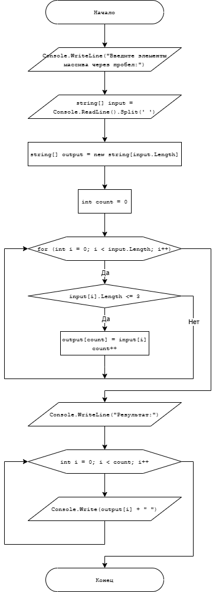

# Итоговая контрольная работа по основному блоку

Алгоритм полноценного выполнения проверочной работы:
1. Создать репозиторий на GitHub
2. Нарисовать блок-схему алгоритма
3. Снабдить репозиторий оформленным текстовым описанием решения (файл README.md)
4. Написать программу, решающую поставленную задачу
5. Использовать контроль версий в работе над этим небольшим проектом

***

### Задача:
Написать программу, которая из имеющегося массива строк формирует новый массив из строк, длина которых меньше, либо равна 3 символам. Первоначальный массив можно ввести с клавиатуры, либо задать на старте выполнения алгоритма. При решении не рекомендуется пользоваться коллекциями, лучше обойтись исключительно массивами.
```
Примеры:
[“Hello”, “2”, “world”, “:-)”] → [“2”, “:-)”]
[“1234”, “1567”, “-2”, “computer science”] → [“-2”]
[“Russia”, “Denmark”, “Kazan”] → []
```

***

### Решение:
1. Вы находитесь в созданном репозитории `Final_test_for_the_main_block`.
2. Блок-схема алгоритма:
> 
3. Вы читаете данный фаил `README.md`.
4. Программа находится в [`уроке 1`](https://github.com/Bystritskaya/Final_test_for_the_main_block/blob/master/Lesson_1 "Открыть решение").

Код программы:
```
Console.Write("Введите элементы массива через запятую: ");
string[] input = Console.ReadLine().Split(',');

string[] output = new string[input.Length];
int count = 0;

for (int i = 0; i < input.Length; i++)
{
    if (input[i].Length <= 3)
    {
        output[count] = input[i];
        count++;
    }
}

Console.WriteLine("Результат:");
for (int i = 0; i < count; i++)
{
    Console.Write(output[i] + " ");
}
```
Результат вывода в терминал:
> 
5. Скриншот журнала изменений (история коммитов).
>